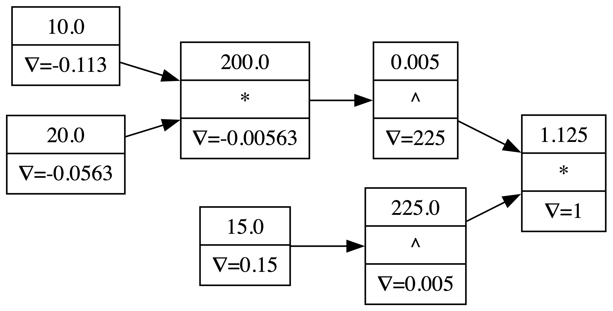

# MikaGrad

MikaGrad is my implementation of an autograd engine which extends Karpathy's [micrograd](https://github.com/karpathy/micrograd) to support arbitrary dimensional tensors, allowing for much more complex and optimized computations. MikaGrad's syntax is Pytorch-like and it implements many of the same methods, allowing for easy adoption by industry users.


## Components
### Autograd Engine (`engine.py`)
The `engine.py` file defines the `Value` class, the building block of an autograd engine. The Value class stores pointers to the Values that were involved in creating it, allowing for the construction of a computation graph, the key in backpropagating gradients. 

- Value class
    - `__add__`, `__mul__`, ...
    - Supports operations with non-Value first
    - Loss functions
### Neural Network Library (`nn.py`)
The `nn.py` file is a small neural network library that defines `Module`, `MLP`, and `Layer` classes. These classes use the Value class to perform all of the vital matrix mulitplications, and non-linearities involved in neural networks. This results in a backpropagation step that requires only two small steps:
```
# backward pass
model.zero_grad()
loss.backward()

# parameter update
for param in model.parameters():
    param.data -= lr * param.grad
```


- Got rid of Neuron class in favour of weight matricies within Layer class. Huge speed up, industry standard

### Visualization Helper (`visualization.py`)
The `visualization.py` file defines `draw_dot` a helper method that generates a png of a computation graph. The code associated with this file was adapted from Karpathy's implementation in micrograd.

**Example Computation Graph:**



### Walkthrough (`walkthrough.ipynb`)
The `walkthrough.ipynb` notebook provides an in-depth demonstration of how the MikaGrad engine works. It covers:
- Visualizing steps of elementary computations
- Side-by-side of manually computing gradients vs. the automatic result
- Implementing a small neural network, and running backpropagation using the autograd engine


## Installation
```
pip install -r requirements.txt
```

## Running tests
In the root directory of the project, run:
```
python -m pytest -q
```